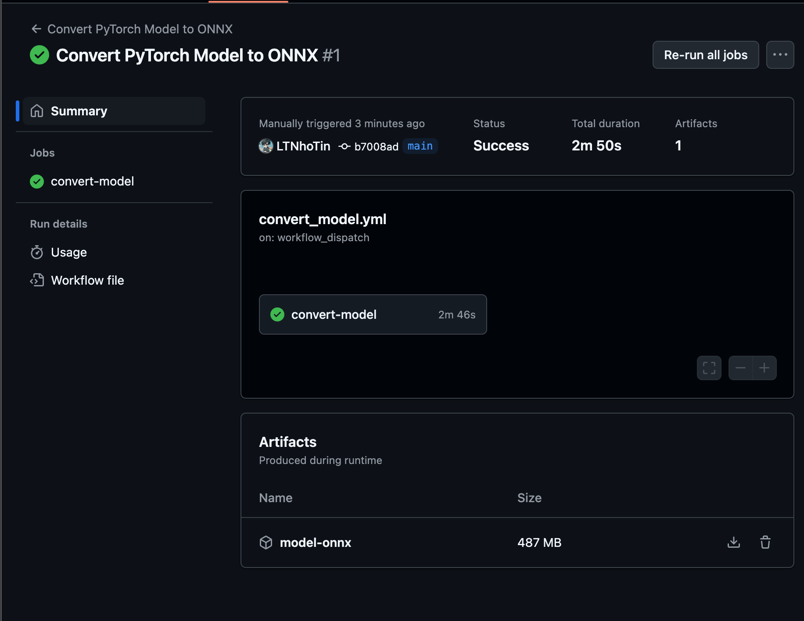

# Báo cáo tìm hiểu và triển khai CI/CD với GitHub Actions

## 1. CI/CD là gì?
- **Continuous Integration (CI)**: Tích hợp code thường xuyên, phát hiện lỗi sớm.
- **Continuous Delivery (CD)**: Tự động triển khai code đã kiểm tra lên môi trường sản phẩm hoặc staging.

## 2. GitHub Actions
Công cụ tích hợp CI/CD trực tiếp vào GitHub.

## 3. Ưu điểm GitHub Actions
- Dễ cài đặt, không phức tạp.
- Linh hoạt kích hoạt workflow từ webhook.
- Workflow tái sử dụng dễ dàng với cộng đồng.

## 4. Xây dựng Pipeline CI/CD convert PyTorch sang ONNX
### Bước 1: Chuẩn bị Repository
Fork và clone repo Segment-Text.

### Bước 2: Thiết lập workflow GitHub Actions
Tạo workflow chuyển đổi model PyTorch sang ONNX tự động.

### Bước 3: Kích hoạt và kết quả
- Workflow chạy thành công.
- Model ONNX tạo thành công, dung lượng ~487MB.
- Workflow được kích hoạt thủ công hoặc khi có thay đổi script.

Kết quả workflow:

### Bước 4: Theo dõi Workflow
- Workflow visualizer: Xem trạng thái workflow trực quan.
- Live logs: Debug nhanh chóng khi có lỗi.

## 5. Kết luận
GitHub Actions giúp đơn giản hóa quá trình CI/CD, tiết kiệm thời gian, giảm lỗi và nâng cao chất lượng sản phẩm.
